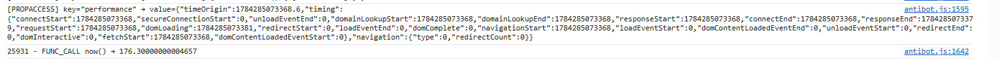
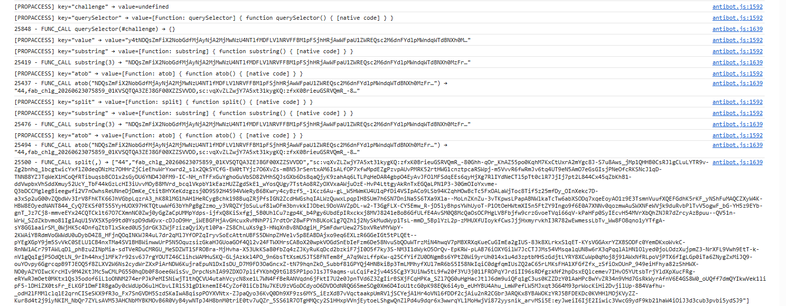
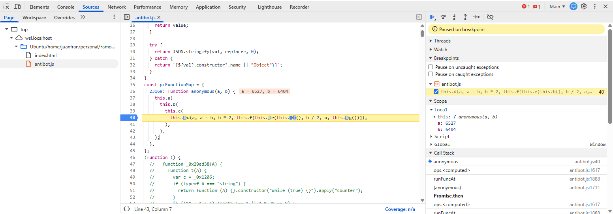
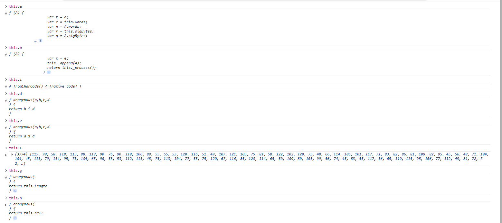
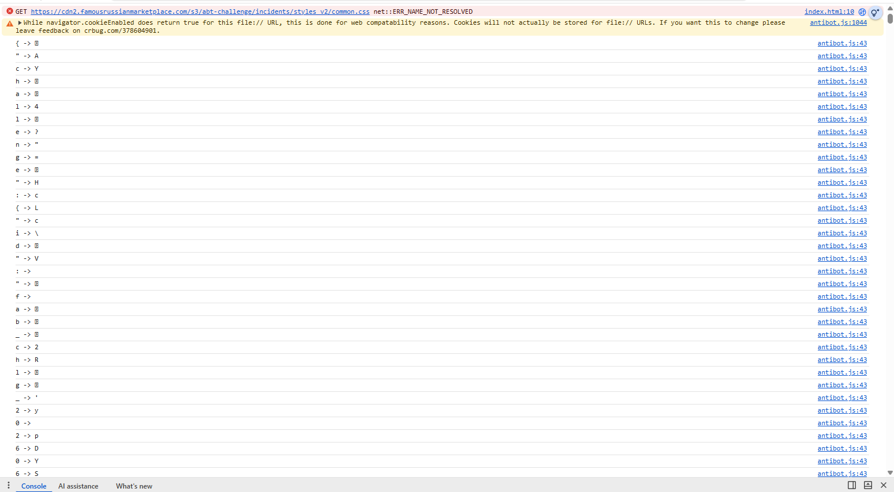
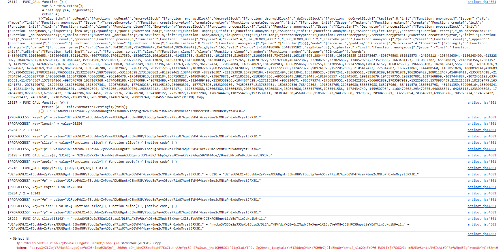
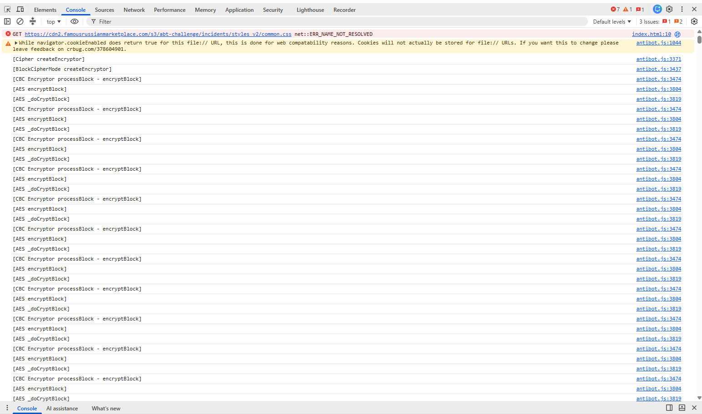
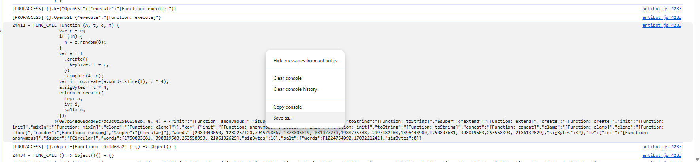
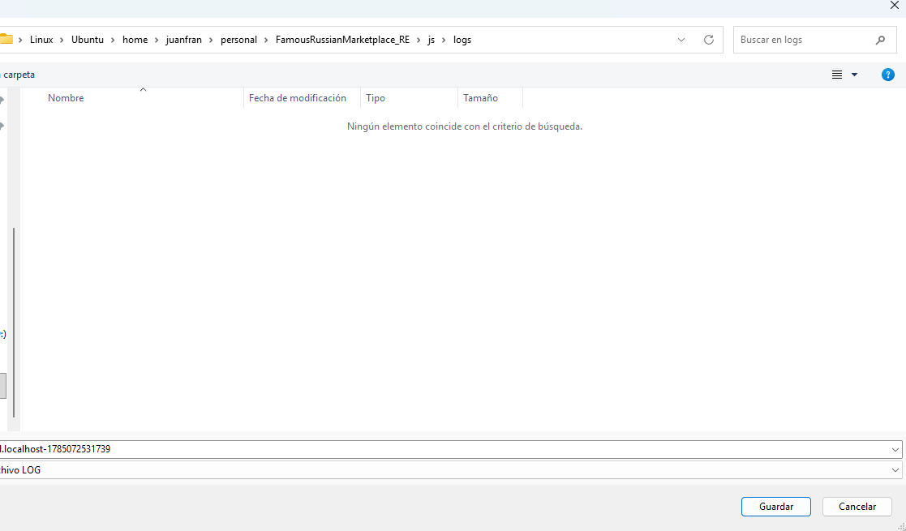

# Reversing FamousRussianMarketplace

This repository documents my full thought process while reversing the JavaScript Virtual Machine used by a major Russian e‑commerce platform. The VM is responsible for generating two critical parameters included in the client payload: `fp` and `token`. The write-up walks through the deobfuscation steps, the VM analysis, the anti-debugging traps, the AST work, and ends by recovering a captured fingerprint in clear text.

Turning this into a working solver is left as an exercise — see [Solver hints](#solver-hints).

**Disclaimer:** This project is for educational and research purposes only. The target is anonymized on purpose. Use of this material must comply with the target website's Terms of Service and applicable data privacy laws.

**Note:** `antibot.js` here is the `"version": "44"` build of the VM; the site now serves `"version": "47_3"`. The mechanism is the same — only some fingerprint fields changed (see [Solver hints](#solver-hints)).

## Table of Contents

- [Repository layout](#repository-layout)
- [Prerequisites](#prerequisites)
- [Initial setup](#initial-setup)
- [Babel AST Deobfuscation](#babel-ast-deobfuscation)
- [Anti-debugging traps](#anti-debugging-traps)
- [Reversing](#reversing)
- [Discovering the AES password](#discovering-the-aes-password)
- [Fingerprint reconstruction](#fingerprint-reconstruction)
- [Solver hints](#solver-hints)

## Repository layout

```
js/
  index.html                  # loads antibot.js, lets you run the VM outside the site
  antibot.js                  # deobfuscated + instrumented VM (the file you debug)
  ast-babel-deobfuscation/    # Babel AST deobfuscation pipeline
    main.js                   # iterative driver, runs the plugins until fixed point
    plugins/evaluate.js       # string-array decryption evaluator
    plugins/evaluatepaths.js  # constant expression folder
    plugins/propdecomputer.js # obj["prop"] → obj.prop
    utils.js                  # binding resolution helpers
    webcracked.js             # input: the webcrack output
    finalOutput.js            # output: the fully deobfuscated script
    steps/                    # per-round, per-plugin intermediate output
screenshots/                  # the DevTools captures referenced below
```

Everything in this write-up runs in the browser. The trace excerpts quoted throughout come from a saved DevTools log; that file is not in the repository — [Saving the trace](#saving-the-trace) shows how to produce your own.

## Prerequisites

- **Node.js 20.19+ / 22+** for the Babel pipeline (it is written as ES modules, so an older Node needs a `"type": "module"` entry in its `package.json`, which also silences the `MODULE_TYPELESS_PACKAGE_JSON` warning), plus [webcrack](https://github.com/j4k0xb/webcrack) for the first deobfuscation pass.
- **A Chromium-based browser.** The whole reversing session happens in DevTools against `js/index.html`; there is no need to sandbox the VM in Node.

## Initial setup
How I took this `antibot.js` code:
1. I Visited the FamousRussianMarketplace website and intercepted the requests using a proxy tool such as Burp Suite.
2. I located the initial HTML file that contains the antibot logic. The JavaScript antibot code is embedded inside the last `<script></script>` tags.
3. I extracted the HTML and the antibot script, saving them separately as `index.html` and `antibot.js`.
(Now the js code it's served in `script_v47_3.js`)
4. In `index.html`, I replaced the last embedded `<script>` with a tag that loads the extracted antibot code like this: `<script src="antibot.js"></script>`
5. Deobfuscate the original JavaScript using WebCrack:

   ```bash
   webcrack original.js -o deobf
   ```

6. The deobfuscated script was saved in `deobf/deobfuscated.js`.

Note: the [js/antibot.js](js/antibot.js) file shown here is the final and reduced version obtained after applying the AST‑based deobfuscation pipeline; the comments can be stripped as well.

## Babel AST Deobfuscation

The deobfuscation process uses Babel AST transformations to simplify the obfuscated JavaScript code. The pipeline lives in [js/ast-babel-deobfuscation/](js/ast-babel-deobfuscation/):

```bash
cd js/ast-babel-deobfuscation
npm install
node main.js
```

The `inputFile` of [main.js](js/ast-babel-deobfuscation/main.js) is `webcracked.js`, which is the previous `deobf/deobfuscated.js` script. Expected output:

```
[+] Starting iterative deobfuscation: ./webcracked.js

=== 🔄 STARTING ROUND 1 ===
[step 1] processing ./plugins/evaluate.js
[step 2] processing ./plugins/evaluatepaths.js
[step 3] processing ./plugins/propdecomputer.js

[!] The code has changed in round 1. Re-iterating...

=== 🔄 STARTING ROUND 2 ===
[step 1] processing ./plugins/evaluate.js
[step 2] processing ./plugins/evaluatepaths.js
[step 3] processing ./plugins/propdecomputer.js

[✔] Fixed point reached: The code is no longer changing.

[🏁] Finished process in 2 rounds.
```

The process runs iteratively (capped at 10 rounds) until the code reaches a fixed point; on this script it converges in **2 rounds** — the second one only confirms that nothing else changes. Each round applies the three plugins in sequence.

The interesting part of the driver is how it decides it's done. Comparing the generated source as a string would keep looping forever on cosmetic differences, so `astHash()` re-parses the code and serializes the AST with the positional and comment metadata stripped out (`start`, `end`, `loc`, `leadingComments`, `trailingComments`, `innerComments`, `extra`), then compares that:

```javascript
if (astHash(currentCode) === hashBeforeRound) {
    isChanged = false;
    console.log(`\n[✔] Fixed point reached: The code is no longer changing.`);
}
```

So the loop stops when the *structure* stops changing, not when the text does.

### 1. evaluate.js - String Decryption Evaluator

This plugin handles the string decryption mechanism used by the obfuscator. The obfuscated code uses a pattern like:

```javascript
_0x1206(236)  // returns a string from the string array
```

**How it works:**
- Identifies function calls whose arguments are *all* numeric literals (negative ones included), e.g. `_0x1206(236)`
- Resolves the callee to its root binding via `resolveToRootBinding` in [utils.js](js/ast-babel-deobfuscation/utils.js), so aliased calls are caught too — `(c = _0x1206)(236)` and `(0, _0x1206)(236)` both resolve back to `_0x1206`
- From that binding it extracts the three pieces the obfuscator needs to produce a string:
  - The IIFE that rotates the string array
  - The string array function itself
  - The decryptor function
- Reassembles those three into a standalone snippet and runs it inside a `node:vm` context with an empty sandbox to get the actual value
- Replaces the call with a `stringLiteral`, `numericLiteral` or `booleanLiteral` depending on what came back

**Example transformation:**
```javascript
// Before
var name = _0x1206(236);

// After
var name = "indexOf";
```

Two details that matter in practice:

- **Resolved decryptors are cached per function name.** Rebuilding and re-running the rotation IIFE for every one of the thousands of call sites would be unusably slow, so the `{ iifeCode, arraysFunctionCode, decryptorCode }` triplet is resolved once and reused.
- **Calls wrapped in `parseInt(...)` are skipped.** The obfuscator also uses the string array to produce numeric strings, and folding those too early breaks the surrounding expression.

Every snippet handed to the VM is also dumped to `debug_vm_runtime.js` before being evaluated, which is what you read when a call site doesn't fold and you need to see the exact code that was reconstructed:

```javascript
/* --- IIFE ROTATION --- */
/* --- ARRAYS --- */
/* --- DECRYPTOR --- */
/* --- CODE TO EVALUATE --- */
_0x1206(236)
```

### 2. evaluatepaths.js - Constant Expression Evaluator

This plugin evaluates constant binary expressions and replaces them with their computed values.

**How it works:**
- Visits every `BinaryExpression` and calls Babel's `path.evaluate()`
- If the evaluation is confident (all operands are known constants) and the result converts to a literal via `t.valueToNode`, it replaces the expression
- Calls `path.skip()` afterwards so the freshly inserted literal isn't re-visited
- Covers arithmetic, bitwise and comparison operators — whatever `path.evaluate()` can fold

This one is the smallest plugin of the three, but it's what makes the previous step's output readable: once the string calls become literals, a lot of the surrounding arithmetic collapses into constants.

**Example transformation:**
```javascript
// Before
var x = 100 + 200;
var y = 5 * 10;

// After
var x = 300;
var y = 50;
```

### 3. propdecomputer.js - Property Decomputer

This plugin converts computed property accesses back to dot notation when possible, making the code more readable.

**How it works:**
- Handles both `MemberExpression` (`obj["prop"]`) and `ObjectProperty` (`{ ["prop"]: 1 }`)
- Checks the string against `/^[a-zA-Z_$][a-zA-Z0-9_$]*$/`, so only valid identifiers are rewritten and things like `obj["0"]` or `obj["a-b"]` are left alone
- Flips `computed` to `false` and swaps the `stringLiteral` for an `identifier`

**Example transformation:**
```javascript
// Before
obj["name"]
obj["value"]
{ ["key"]: 1 }

// After
obj.name
obj.value
{ key: 1 }
```

Purely cosmetic, but it's what turns the output into something you can actually read in DevTools — and it's why the handler code quoted later in this README reads as `A.getByte()` instead of `A["getByte"]()`.

### Output

After the process completes:
- Intermediate steps are saved in the `steps/` directory, one file per round and plugin: `round1_step1_evaluate.js`, `round1_step2_evaluatepaths.js`, `round1_step3_propdecomputer.js`, and so on. These are the ones to diff when a round does something you didn't expect.
- The final deobfuscated code is saved as `finalOutput.js`. That file is the starting point for the next section.

## Anti-debugging traps

With the script deobfuscated, we can now remove the anti‑debugging traps. Several of these traps can be neutralized by commenting out the code along with the calls that trigger them. The script also contains unused or decoy IIFEs, which can be safely commented out as well.

Note that traps 2, 4 and 5 are all wrapped by a helper of the form `_0xXXXXXX(this, function () { ... })` (`_0x56aa45`, `_0xad0626`, `_0x58f901`). Those are the same self-defending wrapper emitted several times under different names, so recognizing the shape once is enough to spot the rest.

1. If it detects that DevTools is open, execution gets repeatedly paused with `debugger` statements so you lose track of the flow and can't debug properly.

```javascript
  function _0x29ed38(A) {
    function t(A) {
      var c = _0x1206;
      if (typeof A === "string") {
        return function (A) {}.constructor("while (true) {}").apply("counter");
      }
      if (("" + A / A).length !== 1 || A % 20 == 0) {
        (function () {
          return true;
        })
          .constructor("debugger")
          .call("action");
      } else {
        (function () {
          return false;
        })
          .constructor("debugger")
          .apply("stateObject");
      }
      t(++A);
    }
    try {
      if (A) {
        return t;
      }
      t(0);
    } catch (A) {}
  }
```

2. Integrity check that verifies the previous function hasn't been tampered with (via regex fingerprinting of its source), and arms/triggers it if intact, or freezes the page with an infinite loop if tampering is detected.

```javascript
(function () {
  _0x56aa45(this, function () {
    var t = new RegExp("function *\\( *\\)");
    var c = new RegExp("\\+\\+ *(?:[a-zA-Z_$][0-9a-zA-Z_$]*)", "i");
    var e = _0x29ed38("init");

    if (t.test(e + "chain") && c.test(e + "input")) {
      _0x29ed38();
    } else {
      e("0");
    }
  })();
})();
```

3. Dynamically resolves a reference to the global object (`window`, `global`, etc.) instead of hardcoding it, then uses it to schedule the debugger trap (`_0x29ed38`) to run every 4 seconds via `setInterval`.

```javascript
  (function () {
    var A;
    var t = _0x1206;
    try {
      A = Function('return (function() {}.constructor("return this")( ));')();
    } catch (t) {
      A = window;
    }
    return A;
  })().setInterval(_0x29ed38, 4000);
```

4. Hijacks the `console` object's methods (`log`, `warn`, `info`, `error`, `exception`, `table`, `trace`) so that calling any of them triggers the defense function instead of actually printing output, preventing its use for tracing execution.

```javascript
    var _0x30cd1f = _0xad0626(this, function () {
      var A;
      var t = _0x1206;
      try {
        A = Function('return (function() {}.constructor("return this")( ));')();
      } catch (t) {
        A = window;
      }
      var c = (A.console = A.console || {});
      for (
        var e = ["log", "warn", "info", "error", "exception", "table", "trace"],
          n = 0;
        n < e.length;
        n++
      ) {
        var r = _0xad0626.constructor.prototype.bind(_0xad0626);
        var a = e[n];
        var o = c[a] || r;
        r.__proto__ = _0xad0626.bind(_0xad0626);
        r.toString = o.toString.bind(o);
        c[a] = r;
      }
    });
```

This one matters more than it looks: the entire technique used later relies on `console.log`, so this trap has to go first.

5. Regular Expression Denial of Service (ReDoS). The function reads its own source code (`.toString()`) and runs a catastrophic-backtracking regex against it, which can hang the browser tab or any tool (e.g. DevTools' "Pretty print") that tries to stringify/analyze the function.

```javascript
var _0x23ee05 = _0x58f901(this, function () {
var A = _0x1206;
return _0x23ee05
   .toString()
   .search("(((.+)+)+)+$")
   .toString()
   .constructor(_0x23ee05)
   .search("(((.+)+)+)+$");
});
```

### Other modifications

Not a trap, but needed to run the VM out of its original page: we replace `window.addEventListener` calls like `window.addEventListener("load", _0x152c94);` with a direct invocation, `_0x152c94();`, since the `load` event never fires the same way when the script is loaded from a local file.

## Reversing

The objective of reversing is to understand how the fingerprint is generated, how it is encrypted, and to replicate that logic so we can avoid using a real browser.

### Tracing technique

After removing the previous traps, the technique I used to reverse this VM was tracing (shoutout to the Chinese community, I learned this from them 😅).

In practice, this means adding logging inside the handlers to expose relevant information: function calls (including certain external functions the VM relies on), object property reads (object writes are usually unnecessary), and arithmetic/bitwise operations. A handler, in this context, is the function that executes a specific operation and is directly tied to an opcode.

At this volume, calling `console.log` on every handler is too slow — the DevTools console renders each line as it arrives. So instead of logging directly, the handlers push to an array, using the `_log()` method:

```javascript
var logs = [];
function _log(val) {
  logs.push(val);
}
```

And it gets dumped once, at the end:

```javascript
for (var log of logs) {
  console.log(log);
}
```

The advantage of this approach is that I don't even need to sandbox the VM in a local Node environment; I can run it directly in the browser via the `index.html` file, which in turn loads `antibot.js`, the file containing the VM's logic.

Even buffered, keeping every handler instrumented at once generates a lot of noise and a huge dump — in some cases enough to freeze the tab. When the trace gets too large (it can reach several gigabytes) there are a few ways to cut it down:

- **Sandbox the VM locally and export to a log file.** Running the VM in a local Node environment lets you redirect all output straight to a file, avoiding the console/DevTools overhead entirely and letting you handle arbitrarily large traces.
- **Selective/conditional logging.** Rather than logging every handler unconditionally, add conditions so a handler only logs for specific opcodes, specific object properties, or once a certain execution counter is reached. This keeps the trace focused on the range you actually care about.
- **Sampling or windowed tracing.** If you only need to inspect a particular section of execution (e.g., right before or after a known trap), enable logging only within that window instead of from the start of the program.
- **Log to a ring buffer / capped array in memory**, then dump it only when a specific condition is hit (e.g., a crash, an error, or a target opcode). This gives you the surrounding context when something interesting happens without keeping the whole run.

That gives a clean and focused trace, without the noise and performance cost of leaving every handler fully instrumented.

Two things to watch when adding the logs: the instrumentation has to preserve the VM's behaviour (log around each operation without changing what it computes), and the VM must not have integrity checks that would notice the handlers were modified — which is exactly why the [anti-debugging traps](#anti-debugging-traps), including the source-fingerprinting one, are removed first.

With that in place: `antibot.js` is a register‑based VM, which we can deduce from the frequent calls to `this.setReg()` and `this.getReg()`.

We can also infer the identity of the Program Counter (PC) from lines such as `this.setReg(_0x19a465.BYTECODE_PTR, 0);` or `return this.bytecode[this.regs[_0x19a465.BYTECODE_PTR]++];`: the register that indexes `this.bytecode` and gets post-incremented on every fetch is the PC. Logging `_0x19a465.BYTECODE_PTR` once shows its register index is **200**, which is why later, inside the `FUNC_CALL` handler, we read the PC as `pc = A.regs[200]`.

### Making the VM deterministic

Before instrumenting anything, it is worth freezing the sources of entropy. The VM relies on several nondeterministic browser APIs such as `Date.now`, `Math.random` and `performance.now`, and those values make each run slightly different, so two traces are never comparable:




In `antibot.js`, I added the following at the beginning of the file:

```javascript
var fixedTime = 1712915000000;
Date.now = function () {
  return fixedTime;
};

Math.random = function () {
  return 0.5;
};

performance.now = function () {
  return 1000.123;
};
```

This ensures that:
- `Date.now()` always returns the same timestamp (the exact value is arbitrary)
- `Math.random()` always returns `0.5` instead of a random value
- `performance.now()` always returns `1000.123` instead of the actual elapsed time

Two caveats worth knowing:

- Overriding `Date.now` does **not** affect `new Date().getTime()`, which still returns the real time. If the VM reads the date through the constructor you have to patch that too.
- As the `performance` screenshot above shows, the VM does not only call `performance.now()`: it also reads the whole `performance.timing` object (`navigationStart`, `domLoading`, `responseEnd`, …) and `timeOrigin`. Those are not frozen by the patch above, and they are exactly the fields we will have to forge later in [Fingerprint reconstruction](#fingerprint-reconstruction).

**Important:** remember to remove these patches when you try to decrypt the fingerprint, as the real values (actual time, true randomness, and performance measurements) are required for the fingerprint/encryption to be valid.

### Instrumenting the handlers

First of all we log the result returned by the VM, we call it `solution`:

```javascript
  async function _0x409816() {
    var A = _0xc52c7c;
    Object.defineProperty(window, "btoam", {
      value: _0x3ea2a7(),
    });
    _0x3ea5dc();
    const solution = await window.runChallenge();
    console.log(solution);
    return solution;
  }
```

To properly format the handler's trace we will observe in the browser, we created the `safe` function:

```javascript
function safe(val, depth = 3) {
  if (val === null) return "null";
  if (val === undefined) return "undefined";
  const t = typeof val;
  if (t === "number" || t === "boolean") return String(val);
  if (t === "string") {
    if (val.length > 100) {
      return `"${val.length > 100 ? val.slice(0, 100) + "…" : val}"`;
    }
    return val;
  }

  if (t === "function") {
    const body = val.toString();
    return `[Function: ${val.name || "anonymous"}] { ${body} }`;
  }

  const seen = new WeakSet();
  function replacer(key, value) {
    if (typeof value === "function")
      return `[Function: ${value.name || "anonymous"}]`;
    if (typeof value === "object" && value !== null) {
      if (seen.has(value)) return "[Circular]";
      seen.add(value);
    }
    return value;
  }

  try {
    return JSON.stringify(val, replacer, 0);
  } catch {
    return `[${val?.constructor?.name || "Object"}]`;
  }
}
```

As we told earlier, we are going to be adding `_log()` to function calls (including certain external functions the VM relies on), object property reads (object writes are usually unnecessary), and arithmetic/bitwise operations.

#### 1. Arithmetic operations

```javascript
this.ops[_0x18c581.ADD] = function (A) {
  var t = _0x2a679d;
  var c = A.getByte();
  var e = A.getByte();
  var n = A.getByte();
  var rv = A.getReg(e);
  var nv = A.getReg(n);

  var operation = "+";

  var result = eval(`rv ${operation} nv`);
  _log(`${safe(rv)} ${operation} ${safe(nv)} → ${safe(result)}`);
  A.setReg(c, result);
};
this.ops[_0x18c581.MUL] = function (A) {
  var t = _0x2a679d;
  var c = A.getByte();
  var e = A.getByte();
  var n = A.getByte();
  var rv = A.regs[e];
  var nv = A.regs[n];

  var operation = "*";

  var result = eval(`rv ${operation} nv`);
  _log(`${safe(rv)} ${operation} ${safe(nv)} → ${safe(result)}`);
  A.setReg(c, result);
};
this.ops[_0x18c581.MINUS] = function (A) {
  var t = _0x2a679d;
  var c = A.getByte();
  var e = A.getByte();
  var n = A.getByte();
  var rv = A.regs[e];
  var nv = A.regs[n];

  var operation = "-";
  _log(`${safe(rv)} ${operation} ${safe(nv)} → ${safe(result)}`);
  var result = eval(`rv ${operation} nv`);

  A.setReg(c, result);
};
this.ops[_0x18c581.DIV] = function (A) {
  var c = A.getByte();
  var e = A.getByte();
  var n = A.getByte();

  var rv = A.regs[e];
  var nv = A.regs[n];

  var operation = "/";

  var result = eval(`rv ${operation} nv`);

  _log_(`${rv} ${operation} ${nv} → ${result}`);

  A.setReg(c, result);
};
```

#### 2. Function calls

```javascript
this.ops[_0x18c581.FUNC_CALL] = function (A) {
  var c = A.getByte();
  var e = A.getByte();
  var n = A.getByte();
  var r = A._loadArrayFromRegister(); // pops the argument list out of the registers

  var fn = A.getReg(e);
  var thisVal = A.getReg(n);
  var result = fn.apply(thisVal, r);

  const fnName = fn.toString().includes("[native code]")
    ? `${fn.name}`.replace("bound", "function")
    : fn.toString();

  const pc = A.regs[200];
  _log(
    `${pc} - FUNC_CALL ${fnName}(` +
      r.map((v) => safe(v)).join(", ") +
      `) → ${safe(result)}`,
  );
  A.setReg(c, result);
};
```

This single handler is the most valuable one: printing the PC next to the callee source gives us a stable address for every function the VM invokes, and that address is what we use to talk about "the function at PC 23169" from here on.

#### 3. Object getter

```javascript
this.ops[_0x18c581.PROPACCESS] = function (A) {
  var t = _0x2a679d;
  var e = A.getByte();
  var r = A.getByte();
  var n = A.getByte();
  r = A.getReg(r);
  n = A.getReg(n);
  var result = r[n];
  _log(`[PROPACCESS] key="${n}" → value=${safe(result)}`);
  A.setReg(e, result);
};
```

### Running the instrumented VM

Once the tracing is in place, the next step is to identify patterns in the trace and reconstruct the original logic (with the help of AI for the repetitive parts).

At this point it's time to execute the JS file we just modified. We don't need to sandbox a Node environment because we can execute this in the browser directly, which already has all the variables needed.

1. Open `index.html` in a browser, right click and open the console, and watch the trace of the VM execution.
2. Right click on the console and choose *Save as…* to save the full trace.
3. Comment and uncomment the different `console.log` calls if you want more clarity.

### Step 1: parsing the challenge

So we reload the page to trigger the VM execution and start analyzing it. This is the first thing that happens:



This is the actual code that corresponds to the previous image:

```javascript
// 1. Get the challenge input element
const challengeInput = document.querySelector("#challenge");

// 2. Read the raw Base64 challenge string
const rawChallenge = challengeInput.value;

// 3. Decode the challenge (skip the first 3 characters)
const decoded = atob(rawChallenge.substring(3));

// 4. Parse the decoded fields
const [version, incident, token] = decoded.split(",");
```

So we have the version, the incident and the token that we are going to send in the payload together with the `fp`. Two things to keep in mind, because both come back later:

- The **token is huge** — several kilobytes, not the ~100 characters that fit on one console line. It is the key of the XOR step *and* part of the AES password input.
- The **incident** looks like a mere identifier (`fab_chlg_<timestamp>_<ULID>`), but it silently controls how many MD5 rounds the password derivation performs. More on that in [Discovering the AES password](#discovering-the-aes-password).

### Step 2: the dynamically generated function at PC 23169

The VM generates multiple functions at runtime, and these also need to be traced. We can detect their execution in the browser trace, but unlike static handlers, we cannot print their arguments or return values. This is expected in a register‑based VM, where most operations happen inside registers and are not directly observable.

The most important one is built at PC 23169, where the trace catches the `Function(...)` constructor assembling it from a string body and returning the anonymous function:

```
L804| 23169 - FUNC_CALL Function(a, b, this.a(this.b(this.c(this.d(a,a-b,b*2,this.f[this.e(this.h(),b/2,a,this.g())])))))
        → [Function: anonymous] { function anonymous(a,b) {
L806|     this.a(this.b(this.c(this.d(a,a-b,b*2,this.f[this.e(this.h(),b/2,a,this.g())]))))
        } }
```

Formatted, that function is:

```javascript
function anonymous(a, b) {
    this.a(
        this.b(
            this.c(
                this.d(
                    a,
                    a - b,
                    b * 2,
                    this.f[this.e(this.h(), b / 2, a, this.g())]
                )
            )
        )
    );
}
```

Later, we will see that this is the function responsible for doing all the operations for encrypting the fingerprint. At this moment, we need to discover what's inside each of the `this.a` … `this.h` values. We can discover that by creating a `pcFunctionMap` object that maps the PC to the function:

```javascript
const pcFunctionMap = {
23169: function anonymous(a, b) {
    this.a(
        this.b(
            this.c(
                this.d(
                    a,
                    a - b,
                    b * 2,
                    this.f[this.e(this.h(), b / 2, a, this.g())]
                )
            )
        )
    );
}
};
```

And then using that inside the `FUNC_CALL` handler to swap the VM-generated function for our own copy, so we get a real breakpointable function body. The only change to the handler shown above is these three lines, right before `A.setReg`:

```javascript
  if (pcFunctionMap.hasOwnProperty(pc)) {
    result = pcFunctionMap[pc];
  }
  A.setReg(c, result);
```

To discover what each of these functions contains, we use the browser's developer tools: we open `index.html` in the browser and set a breakpoint inside the `pcFunctionMap` object we just added to [js/antibot.js](js/antibot.js).



When the breakpoint is hit, we can inspect the values stored in the VM's internal fields and see what's inside each of `this.a` … `this.h`.



With this information, we can deduce that:

- `this.a` behaves like CryptoJS's `concat` function, it concatenates two `WordArray` objects.
- `this.b` behaves like CryptoJS's `process` function (`this._append(A); return this._process();`), it buffers data and feeds it into the underlying block algorithm.
- `this.c` is `String.fromCharCode()`
- `this.d` is `(second argument) ^ (fourth argument)`
- `this.e` is `(first argument) % (fourth argument)`
- `this.f` is an array that stores the token in ASCII form. In this run it holds **3774 bytes** — the token really is that long, so the console truncates it. You can convert that array to a string using `String.fromCharCode`, and you can convert a string back to an ASCII array using `charCodeAt`, like the code below shows:

```javascript
// first 100 bytes of this.f only — the real array is 3774 entries long
const arr = [115, 99, 58, 118, 113, 88, 118, 90, 76, 90, 119, 106, 89, 55, 65, 53, 120, 116, 51, 49, 107, 121, 103, 75, 81, 58, 122, 102, 120, 75, 48, 66, 114, 105, 101, 117, 71, 83, 82, 86, 81, 109, 82, 95, 45, 56, 48, 71, 104, 104, 45, 113, 79, 114, 95, 75, 104, 65, 90, 53, 53, 112, 111, 48, 75, 113, 104, 77, 55, 75, 120, 67, 116, 85, 120, 114, 65, 50, 109, 89, 103, 99, 56, 74, 45, 83, 55, 117, 56, 65, 119, 115, 95, 106, 77, 112, 49, 81, 72, 72];

const text = arr.map(x => String.fromCharCode(x)).join('');
console.log(text);
// output: sc:vqXvZLZwjY7A5xt31kygKQ:zfxK0BrieuGSRVQmR_-80Ghh-qOr_KhAZ55po0KqhM7KxCtUxrA2mYgc8J-S7u8Aws_jMp1QHH
```

That string is the beginning of the session token we parsed in step 1, which is the first hint that this function is doing something with the token as a key.

- `this.g` is `this.length` (the token length)
- `this.h` is `this.hc++` (a monotonic counter)

With that said, we can simplify the function generated at PC 23169 down to:

```javascript
const pcFunctionMap = {
  23169: function anonymous(a, b) {
    const ascii = a - b;
    const tokenAscii = this.f;
    const xorOperationResult = String.fromCharCode(
      ascii ^ tokenAscii[this.h() % this.g()],
    );
    _log(`${String.fromCharCode(ascii)} -> ${xorOperationResult}`);
    this.a(this.b(xorOperationResult));
  }
};
```

The breakpoint screenshot above confirms the first two arguments: `a = 6527`, `b = 6404`, so `ascii = a - b = 123`, which is `{` — exactly the first character of the JSON fingerprint, and exactly the first line we are about to see in the trace.

So this function runs **once per character of the fingerprint**. Each call:

1. Recovers the original character code (`ascii = a - b`). The VM never holds the plaintext character, only two numbers whose difference is the character.
2. XORs it against a byte of the token (`this.f`), cycling through the token with a repeating-key pattern (`this.h() % this.g()`).
3. Feeds the resulting character into `this.b` / `this.a` (the internal `process`/`concat` equivalents), which accumulate every processed character into a running `WordArray`.

Once the VM has looped over every character of the fingerprint, that accumulated `WordArray` is what we will call `xoredFP`. We can replicate this same repeating-key XOR with a plain JavaScript function:

```javascript
function xorInputWithToken(input, token) {
  let output = "";
  for (let i = 0; i < input.length; i++) {
    output += String.fromCharCode(input.charCodeAt(i) ^ token.charCodeAt(i % token.length));
  }
  return output;
}

const xoredFP = xorInputWithToken(fingerprintAsText, token);
```

We don't see CryptoJS imported anywhere, by the way, which suggests this JS logic bundles its own internal implementation replicating CryptoJS's behaviour.

### Step 3: reading the fingerprint in clear text

With all the logs commented out except the one inside PC 23169, we can observe the start of the fingerprint when we reload the page:



The left column is the plaintext fingerprint, character by character. We can see that this part contains the fragment `{"challenge":{"id":"fab_chlg_20260623075859_01KVSQTQA3ZEJ8GF00XZZSVVDD"…`, so at this point we are already able to copy and paste the full fingerprint out of the console.

That doesn't mean we are able to *replicate* it — there are fields we still need to discover how they are created. And copying characters out of a console pane is not something you want to do twice, so there is a better and more reliable way to obtain it, which we cover in [Decrypting the fingerprint](#decrypting-the-fingerprint): decrypt the encrypted fingerprint once we identify the encryption method.

At this moment the exact encryption method is still unconfirmed; the only thing that is certain is that `this.a` and `this.b` play a role in it.

### Step 4: from WordArray to the encrypted fp

To continue reversing this VM, we need to run the full trace and jump to the end, where the `fp` field is assembled. In my case I logged everything (as shown in the screenshot), but in practice it's enough to log only the `FUNC_CALL` entries.



We can observe that when the VM calls `formatter.stringify(this)`, the internal `WordArray` (the large list of 32‑bit integers) is converted into a Base64 string using the OpenSSL format. This is why the encrypted fingerprint starts with `U2FsdGVkX1...`, which is the Base64 encoding of `"Salted__"`. From this we can infer that the `fp` field is derived from that `WordArray`, so the next step is to analyze how the `WordArray` is built — and that is also what ultimately reveals the encryption method.

The last twenty lines of the log spell out the assembly step by step. This is the tail of the trace, verbatim:

```
L548799| 25117 - FUNC_CALL function (A) {
L548800|            return (A || this.formatter).stringify(this);
L548801|          }() → "U2FsdGVkX1/5mEQMjrJnNlcTsA1TwO1c3wWj1J3U8SAU3Lwlfc…"
L548803| [PROPACCESS] {}.length=26604
L548804| 26604 / 2 → 13302
L548808| 25198 - FUNC_CALL slice(0, 13302) → "U2FsdGVkX1/5mEQMjrJnNlcTsA1TwO1c3wWj1J3U8SAU3Lwlfc…"
L548810| 25218 - FUNC_CALL apply(null, [100,51,49,48]) → d310
L548811| "U2FsdGVkX1/5mEQMjrJnNlcTsA1TwO1c3wWj1J3U8SAU3Lwlfc…" + d310 → "U2FsdGVkX1/5mEQ…"
L548818| 25292 - FUNC_CALL slice(13302) → "Zjuq+BcZgV6SMtbz/6cGvkT6guEUD+SYjzcTnZZEcDLXY0C8Izf…"
L548819| "U2FsdGVkX1/5mEQMjrJnNlcTsA1TwO1c3wWj1J3U8SAU3Lwlfc…" + "Zjuq+BcZgV6SMtbz…" → "U2FsdGVkX1/5mEQ…"
L548820| {token: 'sc:vqXvZLZwjY7A5xt31kygKQ:zfxK0BrieuGSRVQmR_-80Ghh…', fp: 'U2FsdGVkX1/5mEQ…'}
```

Note `apply(null, [100,51,49,48])` on L548810: those are the character codes of `d`, `3`, `1`, `0` — a `String.fromCharCode` round trip that turns the four bytes back into `"d310"` before splicing them in. The VM never holds that string directly.

So the final assembly is plain string surgery:

```javascript
const rawEncryptedFP = someLibrary.encrypt().toString();   // "U2FsdGVkX1/5mEQMjrJnNlc..."
const length = rawEncryptedFP.length;                      // 26604 in this run
const divided = Math.floor(length / 2);                    // 13302
const fpFirstHalf = rawEncryptedFP.slice(0, divided);
const insert = "d310";                                     // 4 chars, see below
const fpSecondHalf = rawEncryptedFP.slice(divided);

const fp = fpFirstHalf + insert + fpSecondHalf;
```

Two notes on this snippet:

- `length / 2` is never fractional in practice: the string is Base64, so its length is always a multiple of 4 — the trace above shows `26604 / 2 → 13302`. Flooring it anyway costs nothing and saves you a surprise.
- I call those 4 characters `insert`, not `nonce`. The trace calls the value `d310` and it *looks* like a nonce, but the fingerprint JSON already has its own `nonce` field and AES has its own salt, so reusing the word for three different things gets confusing fast. What this value actually is, as we are about to see, is the seed of the AES password.

### Identifying AES from the logs

For me this was the hardest part to figure out: understanding how that large array of words was built, since it was directly tied to how the fingerprint was encrypted. To discover the encryption method, I added `console.log` statements to **every** function whose name contains the word "crypt". This includes:

- `Cipher.createEncryptor` and `Cipher.createDecryptor`
- `BlockCipherMode.createEncryptor` and `BlockCipherMode.createDecryptor`
- `StreamCipher.encrypt` and `StreamCipher.decrypt`
- `CBC.Encryptor.processBlock` and `CBC.Decryptor.processBlock`
- `SerializableCipher.encrypt` and `SerializableCipher.decrypt`
- `PasswordBasedCipher.encrypt` and `PasswordBasedCipher.decrypt`
- `AES.encryptBlock`, `AES.decryptBlock`, and `AES._doCryptBlock`

Reloading the page with only those logs enabled, we get:



Out of the whole list, only these ever fire:

- `Cipher.createEncryptor`
- `BlockCipherMode.createEncryptor`
- `CBC.Encryptor.processBlock`
- `AES.encryptBlock`
- `AES._doCryptBlock`

I removed the ones that were never triggered during the VM execution — they are there to confuse the reverser. What's left tells us the mode straight away: **CBC**, encrypt-only, AES.

### Saving the trace

From this point on the interesting parts of the execution are buried thousands of lines deep, and screenshots of a console pane stop being useful — so the rest of this write-up follows the trace as text, out of a saved log file.

To save it, click anywhere in the console, right click, then *Save as…*:



Then pick the local folder and save:



That gives a single `.log` file — in my run, 548964 lines and 36 MB with `FUNC_CALL` and `PROPACCESS` logging enabled. Every excerpt below is quoted from it, with the original line numbers, so the numbers line up across sections: they all come from the same execution.

Now, if we enable the PC 23169 log *and* `AES.encryptBlock` at the same time, we can watch the two halves of the process interleave. Each `char -> char` line is one iteration of the XOR loop (plaintext byte on the left, XOR'd byte on the right — a non-printable byte shows as `·`), and every 16 of them are followed by one `[AES encryptedBlock]` of four 32-bit words:

```
L1559| [AES encryptedBlock] 350010405,2109944962,-1600710141,1011463747
L1560| 6 -> D
L1561| 0 -> Y
L1562| 6 -> S
L1563| 2 -> G
L1564| 3 -> t
L1565| 0 -> c
L1566| 7 -> e
L1567| 5 -> c
L1568| 8 -> i
L1569| 5 -> X
L1570| 9 -> k
L1571| _ -> ·
L1572| 0 -> ·
L1573| 1 -> ·
L1574| K -> {
L1575| V -> ·
L1576| [AES encryptedBlock] -1344682166,698352206,1538948195,-1581604986
L1577| S -> ;
L1578| Q -> 9
L1579| T -> y
L1580| Q -> ·
L1581| A -> ·
L1582| 3 -> A
L1583| Z -> ·
L1584| E -> ·
L1585| J -> "
L1586| 8 -> y
L1587| G -> ·
L1588| F -> s
L1589| 0 -> ·
L1590| 0 -> @
L1591| X -> 7
L1592| Z -> j
L1593| [AES encryptedBlock] 79845358,1216961176,-1500438074,-1171289596
```

The left column spells out part of the fingerprint (`…6062307585 9 01K V…`) as the loop walks it byte by byte. Sixteen bytes go in, one 16-byte block comes out: that is the proof that the word list is built by packing groups of four bytes into each 32-bit word, four words to a block.


The first thing worth counting in the log is the cipher blocks:

```
L1444| [AES encryptedBlock] 1460908045,1405152604,-553278508,-1646989024
L1559| [AES encryptedBlock] 350010405,2109944962,-1600710141,1011463747
L1576| [AES encryptedBlock] -1344682166,698352206,1538948195,-1581604986
L1593| [AES encryptedBlock] 79845358,1216961176,-1500438074,-1171289596
```

There are **1246** of those lines in the whole trace, which is 1246 × 16 = 19936 bytes of ciphertext — the size of the JSON fingerprint. So every byte of the fingerprint goes through AES, in 16-byte blocks, interleaved with the XOR loop exactly as we saw above.

And those blocks *are* the fingerprint, in order. Just before the final `stringify`, the VM builds the cipher object and logs it whole — and its `ciphertext.words` array is simply every `[AES encryptedBlock]` concatenated, block after block, in the order they were logged:

```
L548778| [PROPACCESS] {}.cp={"init":"[Function: init]", … }
L548779| 25056 - FUNC_CALL function () { … return A; }
L548783|   }({ … "iv":{"words":[2098857796,1524549284,1941625031,-1727231092],"sigBytes":16},
              "salt":{"words":[-107461620,-1900910794],"sigBytes":8},
              "ciphertext":{ … "words":[
                 1460908045,1405152604,-553278508,-1646989024,   ← block₁  (L1444)
                  350010405,2109944962,-1600710141,1011463747,   ← block₂  (L1559)
                -1344682166, 698352206,1538948195,-1581604986,   ← block₃  (L1576)
                   79845358,1216961176,-1500438074,-1171289596,  ← block₄  (L1593)
                … 1242 more blocks … ] }})
```

That is the block-by-block correspondence the highlighting shows visually: the first four words of `ciphertext.words` are block₁, the next four are block₂, and so on for all 1246. The `salt` above (`[-107461620,-1900910794]` = bytes `f998440c8eb26736`) is the same salt that turns up as `U2FsdGVkX1…` once `Salted__` + salt + this ciphertext is Base64-encoded into the `fp`.

One caveat: that `ciphertext.words` dump is truncated in the live console (`Show more (113 kB)`) and the string values are cut to about 100 characters, so you can only read the start of it in DevTools. The per-block `[AES encryptedBlock]` lines are the complete record — and, as shown, they are exactly what the array chains together.

The encrypted fingerprint starting with `U2FsdGVkX1...` — the Base64 of `"Salted__"`, the header OpenSSL prepends right before the 8-byte salt — also confirms we're dealing with **password-based AES** using `EVP_BytesToKey` for key derivation.

The object dumps in the trace pin down every remaining parameter:

| Parameter | Value | Where it shows up |
| --- | --- | --- |
| Cipher | AES | `AES.encryptBlock` / `_doCryptBlock` firing |
| Mode | CBC | only `CBC.Encryptor.processBlock` fires |
| Padding | Pkcs7 | `padding: { pad, unpad }` in the cipher dump |
| Key size | 8 words = **256 bits** | `keySize: 8` in the dump, and `execute(password, 8, 4)` |
| IV size | 4 words = 128 bits | `ivSize: 4`, `iv.sigBytes: 16` |
| Salt | 8 bytes, random per run | `salt.sigBytes: 8` |
| KDF | `EVP_BytesToKey`, MD5, 1 iteration | `kdf.OpenSSL.execute` |

In other words: **plain `CryptoJS.AES.encrypt(plaintext, password)` with all defaults**, which is AES-256-CBC + PKCS7 + OpenSSL-style key derivation. So the whole encryption step reduces to:

```javascript
const encryptedFP = CryptoJS.AES.encrypt(xoredFP, password).toString();
```

The next step is to figure out how that `password` is actually built.

## Discovering the AES password

To discover the AES password, we jump into `CryptoJS.kdf.OpenSSL.execute` (the OpenSSL-compatible key derivation function, equivalent to `EVP_BytesToKey`). Its signature matches CryptoJS's implementation exactly — `(password, keySize, ivSize, salt)` — as does its internal logic (generating a random salt when none is provided, deriving `keySize + ivSize` words via `EvpKDF`, then splitting the result into `key` and `iv`), confirming this is at minimum a faithful reimplementation.

Grepping the log for it shows the KDF being reached, and the password arrives already built:

```
L719| [PROPACCESS] {}.k={"OpenSSL":{"execute":"[Function: execute]"}}
L720| [PROPACCESS] {}.OpenSSL={"execute":"[Function: execute]"}
```

The call itself carries the three values that fix the whole scheme — the password, `keySize = 8` and `ivSize = 4`:

```
FUNC_CALL function (A, t, c, n) {
    var r = e;
    if (!n) { n = o.random(8); }
    var a = l.create({ keySize: t + c }).compute(A, n);
    var i = o.create(a.words.slice(t), c * 4);
    a.sigBytes = t * 4;
    return b.create({ key: a, iv: i, salt: n });
  }(097b54ed68ddd49c7dc3c0c25a66580b, 8, 4)
```

So the password is `097b54ed68ddd49c7dc3c0c25a66580b`. Now we need to find where that string comes from, which is what the rest of the log tells us.

### The MD5 chain

Here's the relevant portion of the trace (trimmed for readability):

```javascript
antibot.js:4283 24213 - FUNC_CALL function (t, c) {
    return new A.init(c).finalize(t);
  }("93652b7e33aa3c1261e5efdc54293cc6sc:vqXvZLZwjY7A5xt31kygKQ:zfxK0BrieuGSRVQmR_-80Ghh-qOr_KhAZ55po0KqhM…")
  → {"words":[178970265,-290594994,1130960028,1367024862],"sigBytes":16}

antibot.js:4283 24218 - FUNC_CALL function (A) {
    return (A || l).stringify(this);
  }() → 0aaade99eeaddf4e4369149c517b24de

antibot.js:4283 24246 - FUNC_CALL function (t, c) {
    return new A.init(c).finalize(t);
  }(0aaade99eeaddf4e4369149c517b24de)
  → {"words":[-351064087,2147199845,274012147,-1025013349],"sigBytes":16}

antibot.js:4283 24282 - FUNC_CALL function (A) {
    return (A || l).stringify(this);
  }() → eb132fe97ffbab65105517f3c2e7899b

antibot.js:4283 24246 - FUNC_CALL function (t, c) {
    return new A.init(c).finalize(t);
  }(eb132fe97ffbab65105517f3c2e7899b)
  → {"words":[835987882,1238246891,633482490,-703253474],"sigBytes":16}

antibot.js:4283 24282 - FUNC_CALL function (A) {
    return (A || l).stringify(this);
  }() → 31d429aa49ce25eb25c22cfad615341e

antibot.js:4283 24246 - FUNC_CALL function (t, c) {
    return new A.init(c).finalize(t);
  }(31d429aa49ce25eb25c22cfad615341e)
  → {"words":[159077613,1759368348,2109980866,1516656651],"sigBytes":16}

antibot.js:4283 24282 - FUNC_CALL function (A) {
    return (A || l).stringify(this);
  }() → 097b54ed68ddd49c7dc3c0c25a66580b
```

*(The `[PROPACCESS]` lines and the `1 + 1 → 2` counter — a loop index driving the repeated MD5 calls — were omitted above for clarity.)*

Note the PCs: the first hash happens at 24213/24218, and then 24246/24282 repeat, which is the loop body. In this run the password is the result of **4 rounds of MD5**, each round hashing the hex output of the previous one:

```javascript
const round1 = CryptoJS.MD5(passwordInput).toString();  // → 0aaade99...
const round2 = CryptoJS.MD5(round1).toString();         // → eb132fe9...
const round3 = CryptoJS.MD5(round2).toString();         // → 31d429aa...
const password = CryptoJS.MD5(round3).toString();       // → 097b54ed... ✅ MATCH
```

**But 4 is not a constant** — see [The number of MD5 rounds is not fixed](#the-number-of-md5-rounds-is-not-fixed) below before you hardcode it.

### Where the first input comes from

The only unknown left is the input to the very first round: `93652b7e33aa3c1261e5efdc54293cc6sc:vqXvZLZwjY7A5xt31kygKQ:zfxK0BrieuGSRVQmR_-80Ghh-qOr_KhAZ55po0KqhM…`

Scrolling up in the log we saved, we can see it comes from a simple string concatenation:

```javascript
antibot.js:4283 93652b7e33aa3c1261e5efdc54293cc6 + "sc:vqXvZLZwjY7A5xt31kygKQ:zfxK0BrieuGSRVQmR_-80Ghh-qOr_KhAZ55po0KqhM7KxCtUxrA2mYgc8J-S7u8Aws_jMp1QHH…"
  → "93652b7e33aa3c1261e5efdc54293cc6sc:vqXvZLZwjY7A5xt31kygKQ:zfxK0BrieuGSRVQmR_-80Ghh-qOr_KhAZ55po0KqhM…"
```

The second operand of the sum is the session token, while the first operand looks like another MD5 hash (32 hex characters) and is still unknown. This translates to:

```javascript
const passwordInput = md5Something + sessionToken;
```

So we scroll up again to find out what "something" is, and see the following trace:

```javascript
antibot.js:4283 [PROPACCESS] {}.random=[Function: anonymous] { function () {
  return 0.5;
} }
antibot.js:4283 647 - FUNC_CALL function () {
  return 0.5;
}() → 0.5
antibot.js:4283 653 - FUNC_CALL String(0.5) → 0.5
antibot.js:4283 [PROPACCESS] {}.h=[Function: anonymous] { function (t, c) {
                    return new A.init(c).finalize(t);
                  } }
antibot.js:4283 668 - FUNC_CALL function (t, c) {
                    return new A.init(c).finalize(t);
                  }(0.5) → {"words":[-753874122,2107195318,-78099687,-1976576212],"sigBytes":16}
antibot.js:4283 674 - FUNC_CALL String({"words":[-753874122,2107195318,-78099687,-1976576212],"sigBytes":16}) → d310cb367d993fb6fb584b198a2fd72c
antibot.js:4283 [PROPACCESS] {}.slice=[Function: slice] { function slice() { [native code] } }
antibot.js:4283 694 - FUNC_CALL slice(0, 4) → d310
antibot.js:4283 23993 - FUNC_CALL function anonymous(a
) {
var i=0,b=[];for(;i<a.length;i++)b.push(a.charCodeAt(i));return b
}(d310) → [100,51,49,48]
antibot.js:4283 [PROPACCESS] {}.apply=[Function: apply] { function apply() { [native code] } }
antibot.js:4283 24018 - FUNC_CALL apply(null, [100,51,49,48]) → d310
antibot.js:4283 [PROPACCESS] {}.h=[Function: anonymous] { function (t, c) {
                    return new A.init(c).finalize(t);
                  } }
antibot.js:4283 24033 - FUNC_CALL function (t, c) {
                    return new A.init(c).finalize(t);
                  }(d310) → {"words":[-1822086274,866794514,1642459100,1411988678],"sigBytes":16}
antibot.js:4283 24039 - FUNC_CALL String({"words":[-1822086274,866794514,1642459100,1411988678],"sigBytes":16}) → 93652b7e33aa3c1261e5efdc54293cc6
```

Notice `Math.random()` returning exactly `0.5` — that's our determinism patch showing up in the trace, and it's what makes this chain reproducible across reloads.

This translates to:

```javascript
const md5Random = CryptoJS.MD5(Math.random().toString()).toString(); // "d310cb367d993fb6fb584b198a2fd72c"
const insert = md5Random.slice(0, 4);                                // "d310"
const md5Something = CryptoJS.MD5(insert).toString();                // "93652b7e33aa3c1261e5efdc54293cc6" ✅ MATCH
```

And there it is: the 4 characters spliced into the middle of the `fp` in step 4 are the **seed of the AES password**. The server pulls them back out of the `fp`, re-derives the password, and decrypts — which is also exactly what lets *us* decrypt our own (or a real browser's) fingerprint.

### The number of MD5 rounds is not fixed

The trace above shows 4 MD5 rounds, and for a long time I assumed that was a constant. It isn't — and the trace says so out loud, a few lines before the chain starts:

```
L631| 24115 - FUNC_CALL function anonymous(a,b,c,d
L632| ) {
L633| return a % d
L634| }(3611, 50, 50, 4) → 3
L635| 1 + 3 → 4
```

That is the `a % d` handler (`this.e` from PC 23169, the same modulo helper the XOR loop uses) computing `3611 % 4 = 3`, and then the `ADD` handler turning it into `1 + 3 = 4`. Four rounds, computed at runtime rather than hardcoded.

The only question left is where `3611` comes from. It is the sum of the character codes of the **incident**:

```javascript
const incident = "fab_chlg_20260623075859_01KVSQTQA3ZEJ8GF00XZZSVVDD";
[...incident].reduce((acc, ch) => acc + ch.charCodeAt(0), 0);   // 3611 ✅ MATCH
```

So the round count is:

```javascript
function md5RoundCount(incident) {
  let sum = 0;
  for (let i = 0; i < incident.length; i++) sum += incident.charCodeAt(i);
  return 1 + (sum % 4);        // 1, 2, 3 or 4
}
```

This run happened to land on 4. A different challenge lands elsewhere: a capture from another session has the incident `fab_chlg_20260626180121_01KW2HFTHTC8325D38MGFNPQG9`, whose codes add up to 3433, so `1 + (3433 % 4) = 2` rounds — and that capture only decrypts with two.

If you hardcode 4, you get the wrong password roughly three times out of four, and the failure looks like a malformed fingerprint rather than a bad key — which makes it miserable to debug.

### Putting it together

At this point the password derivation is fully known:

```javascript
function getPassword(sessionToken, incident, insert) {
  const rounds =
    1 +
    ([...incident].reduce((acc, ch) => acc + ch.charCodeAt(0), 0) % 4);

  let password = CryptoJS.MD5(CryptoJS.MD5(insert).toString() + sessionToken).toString();
  for (let i = 1; i < rounds; i++) {
    password = CryptoJS.MD5(password).toString();
  }
  return password;
}
```

And the full encryption path, end to end:

```javascript
function splitChallenge(challengeInput) {
  const rawChallenge = challengeInput.value;
  const decoded = atob(rawChallenge.substring(3));
  return decoded.split(",");
}

function xorInputWithToken(input, token) {
  let output = "";
  for (let i = 0; i < input.length; i++) {
    output += String.fromCharCode(input.charCodeAt(i) ^ token.charCodeAt(i % token.length));
  }
  return output;
}

// See "Fingerprint reconstruction" for how this object is actually filled.
const fingerprintAsText = JSON.stringify(buildFingerprint());

const challengeInput = document.querySelector("#challenge");
const [version, incident, sessionToken] = splitChallenge(challengeInput);

const xoredFP = xorInputWithToken(fingerprintAsText, sessionToken);

const insert = CryptoJS.MD5(Math.random().toString()).toString().slice(0, 4);
const password = getPassword(sessionToken, incident, insert);

const rawEncryptedFP = CryptoJS.AES.encrypt(xoredFP, password).toString();
const divided = Math.floor(rawEncryptedFP.length / 2);
const fp = rawEncryptedFP.slice(0, divided) + insert + rawEncryptedFP.slice(divided);

const payload = {
  fp: fp,
  token: sessionToken,
  // ...plus a few flat fields the endpoint also expects
};
```

### Decrypting the fingerprint

Because the `insert` travels inside the `fp` itself, the process is fully reversible with nothing but the challenge (which we can read from the initial HTML) and the `fp` (which we can read from the payload of the `POST /abt/result` request). That is what lets us dump a *real* browser's fingerprint instead of transcribing it character by character out of the console.

```javascript
function extractInsertAndEncryptedFP(fp) {
  const encryptedFPLength = fp.length - 4;      // the insert takes up 4 characters
  const divided = Math.floor(encryptedFPLength / 2);

  const fpFirstHalf = fp.slice(0, divided);
  const insert = fp.slice(divided, divided + 4);
  const fpSecondHalf = fp.slice(divided + 4);

  return { insert, rawEncryptedFP: fpFirstHalf + fpSecondHalf };
}

function obtainFingerprintAsText(fpToken, challengeInput) {
  const [version, incident, sessionToken] = splitChallenge(challengeInput);

  const { insert, rawEncryptedFP } = extractInsertAndEncryptedFP(fpToken);
  const password = getPassword(sessionToken, incident, insert);

  const xored = CryptoJS.AES.decrypt(rawEncryptedFP, password).toString(CryptoJS.enc.Utf8);

  // XOR is its own inverse, so the same function undoes it
  return xorInputWithToken(xored, sessionToken);
}
```

Putting the pieces together, the whole reconstruction is about forty lines of JavaScript with no dependency beyond CryptoJS:

```javascript
function md5(s) {
  return CryptoJS.MD5(s).toString();
}

function md5RoundCount(incident) {
  let sum = 0;
  for (let i = 0; i < incident.length; i++) sum += incident.charCodeAt(i);
  return 1 + (sum % 4);
}

function reconstructFingerprint(fp, rawChallenge) {
  // 1. the challenge: base64 after a 3-character prefix, three comma-separated fields
  const decoded = atob(rawChallenge.trim().slice(3));
  const first = decoded.indexOf(",");
  const second = decoded.indexOf(",", first + 1);
  const incident = decoded.slice(first + 1, second);
  const token = decoded.slice(second + 1);

  // 2. pull the 4-character insert back out of the middle of the fp
  const at = Math.floor((fp.length - 4) / 2);
  const insert = fp.slice(at, at + 4);
  const ciphertext = fp.slice(0, at) + fp.slice(at + 4);

  // 3. re-derive the password: MD5^n(MD5(insert) + token), n from the incident
  let password = md5(md5(insert) + token);
  const rounds = md5RoundCount(incident);
  for (let i = 1; i < rounds; i++) password = md5(password);

  // 4. AES-256-CBC + PKCS7 + EVP_BytesToKey, all selected by passing a string password.
  //    Latin1, not Utf8: the plaintext is XOR'd bytes, not text, until step 5 undoes it.
  const xored = CryptoJS.AES.decrypt(ciphertext, password).toString(CryptoJS.enc.Latin1);

  // 5. XOR is its own inverse, so the same loop undoes it
  return xorInputWithToken(xored, token);
}
```

Run that against a captured `fp` and the challenge that produced it, and you get the fingerprint the browser actually sent.

## Fingerprint reconstruction

With that in hand we can stop reading the fingerprint out of the console one character at a time and just decrypt a real capture. Both inputs are readable with a proxy such as Burp Suite: the `challenge` is the value of `<input id="challenge">` in the initial HTML, and the `fp` is a field of the `POST /abt/result` body.

The result is a single minified JSON object with 31 top-level groups:

```
challenge, user_agent, browser, props, screen_1, screen_2, screen_3, touch,
battery, location, context, storage, hev, media_devices, navigator,
performance, video, webgl, canvas, fn_1, fn_2, fn_3, ts, nonce, pzs, pzc,
css, rtc, fonts, timings, ctm
```

The naming convention tells you where every value came from: `@get:userAgent` is a property read, `@proto:Navigator` is the prototype it was read on, `@val:` is a plain value. That mapping is what makes the object legible — and it is the same convention the `PROPACCESS` handler prints, which is how the two can be lined up. The trace records each read as it happens:

```
L5975| [PROPACCESS] {}.location={"ancestorOrigins":{},"href":"file://…/js/index.html",
                                 "origin":"file://","protocol":"file:","host":"wsl.localhost",…
```

and the decrypted fingerprint carries the result of that same read under `location`. Working through the groups is mechanical: find the `PROPACCESS` line in the log, find the matching key in the decrypted JSON, and you know which browser API produced it.

Most of the groups are static for a given browser build, so only a handful have to be recomputed per session. Those are the ones the trace shows being derived at runtime:

```javascript
const nowTime = Date.now();
const ts = nowTime + 160862458;      // fixed offset, taken from the capture

fp.challenge.id = incident;          // from the challenge
fp.challenge.version = version;      // from the challenge
fp.challenge.checkStr = checkStr;    // in this version it's empty
fp.ts = ts;
fp.nonce = md5(String(ts)).slice(-7);
fp.pzs = token.slice(0, 20);
fp.pzc = proofOfWork(fp.pzs);        // see "The proof of work" below
```

Note the `nonce` field: the last 7 hex characters of `MD5(ts)`. This is a *different* value from the 4-character `insert` spliced into the `fp` — one more reason not to call that one a nonce.

The `performance.timing` block is the fiddly one. It has to be a set of offsets from `navigationStart` in the order a real navigation produces (`fetchStart` ≤ `requestStart` ≤ `responseStart` ≤ `domLoading` ≤ `domInteractive` ≤ `loadEventEnd`); plausible numbers in the wrong order are worse than no numbers. The real shape is the one captured back in [Making the VM deterministic](#making-the-vm-deterministic), where the VM reads the whole `performance.timing` object in one go.

Finally, whatever you fill in has to agree with itself. The user agent, the `hev` client-hint brands and `navigator.appVersion` all describe the same browser build, and the trace shows the VM reading all three. A fingerprint that claims one version in the UA and another in the brands array is an inconsistency the server gets for free.


### The proof of work

Two of those fields are not browser signals at all — `pzs` and `pzc` are a proof of work, and this is the part that costs real CPU time. Both are fields *of the fingerprint*, not of the request body, so they get XOR'd and encrypted along with everything else and reach the server inside `fp`.

`pzs` is the first 20 characters of the session token. `pzc` is the answer to the work: a counter the VM increments until a hash of `pzs + pzc` clears a difficulty target, so it is the one field that has to be searched for rather than computed.

The difficulty is announced in the challenge, not baked into the script. The session token's last colon-separated segment is Base64-encoded JSON, and the trace catches the VM decoding it and then turning `pz` into a target string of that many zeros:

```
L27866| 18202 - FUNC_CALL atob(eyJweiI6IjE2Iiwic3VwcG9ydF9kb21haW4iOiJ3d3cuZmFtb3VzcnVzc2lhbm1hcmtldHBsYWNlLmNvbSJ9)
                          → {"pz":"16","support_domain":"www.famousrussianmarketplace.com"}
L27876| [PROPACCESS] {}.pz=16
L27878| 16 + 1 → 17
L27879| 18332 - FUNC_CALL Array(17) → [null, … 17 nulls … ]
L27880| 18338 - FUNC_CALL join(0) → 0000000000000000
```

`Array(pz + 1).join("0")` is the classic way to make a run of `pz` zeros — here 16 of them. That string is the target.

Then the search. Each iteration hashes `pzs + counter`, converts the digest to a **binary string**, and tests it with `startsWith` against those 16 zeros — a string prefix test, not a bitwise one:

```
L27882| sc:vqXvZLZwjY7A5xt31 + 0 → sc:vqXvZLZwjY7A5xt310
L27888| FUNC_CALL …finalize(sc:vqXvZLZwjY7A5xt310) → {"words":[-1231280875,-1440248848,-1053293829,1477805469],"sigBytes":16}
L27901| FUNC_CALL stringify(…) → "1011011010011100001001010001010110101010…"   (128 bits)
L27903| 18445 - FUNC_CALL startsWith(0000000000000000) → false
L27904| 0 + 1 → 1
```

The `sigBytes:16` on the digest — 128 bits, not 160 — already says MD5 rather than SHA-1, and the words confirm it exactly: `CryptoJS.MD5("sc:vqXvZLZwjY7A5xt310")` produces `[-1231280875, -1440248848, -1053293829, 1477805469]`. So it is **plain MD5 of `pzs + counter`**, not the HMAC I first assumed — the token is concatenated into the message, not used as a key.

It runs until a digest comes out with 16 leading zero bits:

```
L543714| sc:vqXvZLZwjY7A5xt31 + 21493 → sc:vqXvZLZwjY7A5xt3121493
L543720| FUNC_CALL …finalize(sc:vqXvZLZwjY7A5xt3121493) → {"words":[11074,182432679,453971555,1743860079],"sigBytes":16}
L543733| FUNC_CALL stringify(…) → "000000000000000000101011010000100000101011011111…"
L543735| 18445 - FUNC_CALL startsWith(0000000000000000) → true
```

The winning counter is `21493` — verifiable independently: brute-forcing `MD5("sc:vqXvZLZwjY7A5xt31" + n)` for the first digest with 16 leading zero bits lands on exactly 21493. Note the gap in line numbers, L27882 to L543714: that one search is over half a million trace lines, which is what "costs real CPU time" means in practice. So:

```javascript
function proofOfWork(pzs, pz) {
  const target = new Array(pz + 1).join("0");     // pz zeros, e.g. "0000000000000000"
  for (let counter = 0; ; counter++) {
    const bits = hexToBinary(CryptoJS.MD5(pzs + counter).toString());
    if (bits.startsWith(target)) return counter;  // this is pzc
  }
}
```

The difficulty comes from the challenge, so anything that hardcodes 16 breaks silently the day the server raises it — read `pz` out of the token instead.


## Solver hints

Everything above is the analysis: how the VM is deobfuscated, how it is traced, and how a captured fingerprint is recovered in clear text. Generating fresh fingerprints and getting them accepted is the part I'm deliberately leaving out — the reversing is the interesting work, and the payload construction is already spelled out in [Fingerprint reconstruction](#fingerprint-reconstruction). What's left is the transport, and that turned out to be the real wall:

- **The site does TLS fingerprinting.** A correct `fp` is not sufficient on its own — the request also has to come from a client whose TLS stack the server accepts.
- **In Python it only worked with `httpcloak`.** The exact same payload sent through `tls-client` or `curl_cffi`, across every Chrome/Edge/Firefox impersonation profile they offer, was rejected. Success is unambiguous to check — the endpoint answers `{"ok": true}` and anything else is a failure — so this is a clean result: the browser-based transport worked, the two impersonation libraries did not.
- **Rotate proxies, one attempt per IP.** A single malformed request flags the IP immediately, and after that even a correct payload is rejected from that address — which makes debugging on one IP misleading, since you end up blaming the payload for an IP problem. Get the payload right against a local decrypt round-trip first, then send each attempt from a fresh proxy.
- **The browser identity has to agree with itself.** Inside the fingerprint, the user agent, the `hev` client-hint brands and `navigator.appVersion` all have to describe the same browser build; a payload that claims one version in the UA and another in the brands array is an inconsistency the server gets for free.
- **A note on versions.** This write-up documents VM **v44** — the build in `antibot.js`. The site now serves `script_v47_3.js` (`"version": "47_3"`), and the mechanism is the same; only some fingerprint fields changed: a new top-level `browser_2` field, a different client-hint brand format (`Not;A=Brand` v8 instead of `Not-A.Brand` v24), and a bumped `challenge.version`. The structure of the reversing holds; the field list does not.

